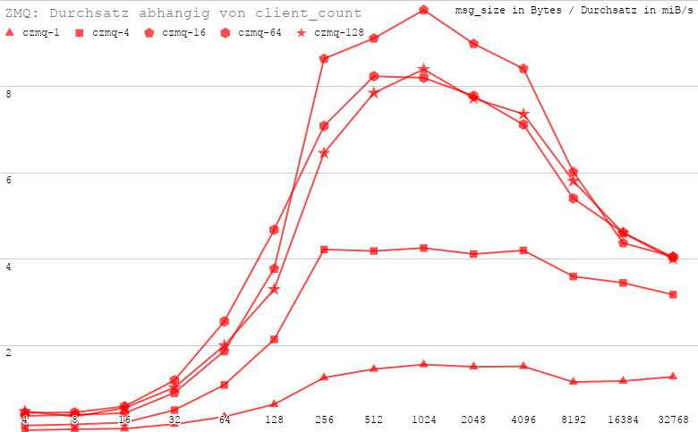
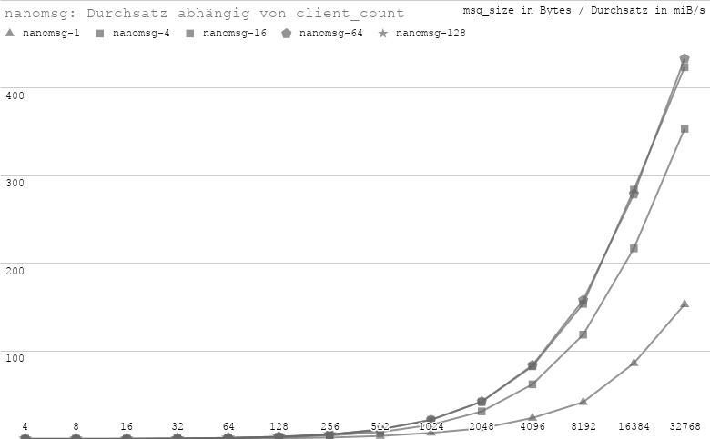
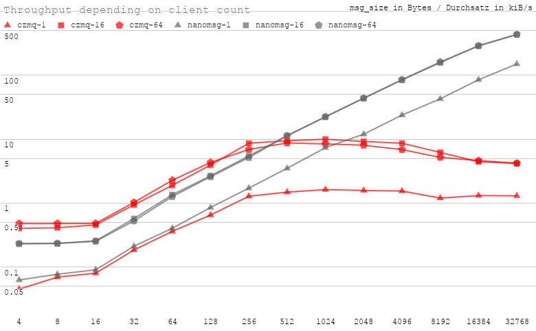
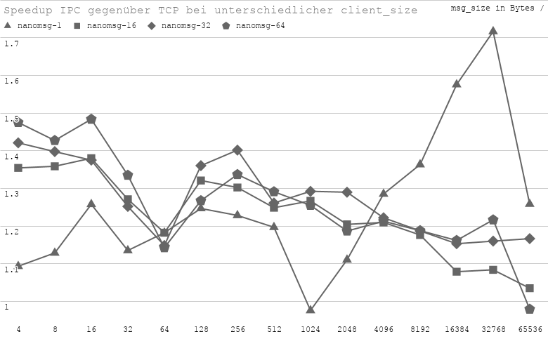

- [Einleitung](#einleitung)
  - [Grischa](#grischa)
  - [Messaging](#messaging)
- [Analyse](#analyse)
- [Planung](#planung)
- [Durchführung](#durchführung)
  - [Worker](#worker)
  - [Router](#router)
  - [Client (Master)](#client-master)
  - [Compiler-Optionen und Ausführendes System](#compiler-optionen-und-ausführendes-system)
- [Erwartungshaltung](#erwartungshaltung)
- [Ergebnisse](#ergebnisse)
  - [ZeroMQ](#zeromq)
  - [nanomsg](#nanomsg)
  - [TCP vs IPC](#tcp-vs-ipc)
- [Diskussion](#diskussion)
- [Zusammenfassung](#zusammenfassung)
- [Ausblick](#ausblick)
- [TODO](#todo)

# Einleitung

Da die vertikale Skalierung von Rechenressourcen aufwändiger wird, wird das nutzen von verteilten Rechenressourcen zunehmend wichtiger. Anstatt ein Rechenproblem einer einzelnen rechenstarken Maschine zu geben, kann die Rechenkraft vieler Maschinen (Nodes) genutzt werden. Dafür ist es wichtig die Aufgabe effizient in Teilaufgaben zu unterteilen sowie die Teilaufgaben and die Nodes auszugeben und einzusammeln. Die Kommunikation zu den Nodes wird oft über Messaging Protokolle gelößt.

Im Rahmen des Forschungsprojekts "Grischa", an der HTW Berlin, wird an Verteilten Systemen geforscht. Grischa ist ein Schachprogramm, welches versucht möglichst viele Züge im Vorraus zu evaluieren und dabei, im Gegensatz zu vielen anderen, ohne Heuristiken oder oder Neuronale Netze arbeitet. Dafür wird eine Menge an Nodes mittels Grid-Computing genutzt, die nach den bestmöglichen Zügen suchen. 
Für die Kommunikation zwischen den verteilten Rechenressourcen wird derzeit die Messaging Bibliothek ZeroMQ benutzt. 

Ziel dieser Arbeit ist die Analyse von Grischas Messaging-System sowie die Evaluation von ZeroMQ mittels Gegenüberstellung zu einer alternative namens nanomsg in den Punkten Geschwindigkeit und Bedienbarkeit. 

## Grischa

Grischa wurde historisch mit verschiedenen Kommunikationsstrategien betrieben, z.B. auch mit Redis. Die für diese Arbeit relevante Implementierung, ZeroMQ, besteht aus 3 Teilanwendungen:

1. "GClient": Zuständig für die zuteilung der Aufgaben sowie Schnittstelle zur Spielfläche/GUI (z.B. XBoard). 
2. "GNode": Stellt die Worker-Node dar. Nimmt Aufgaben vom GClient entgegen und bewertet Spielzüge. Je mehr GNode Instanzen erstellt werden, desto mehr Spielzüge können berechnet werden.
3. "GBroker": Stellt den Message Broker dar, der die Kommunikation zwischen den Anwendungen GClient und GNode handhabt. Zwar kann ZeroMQ auch ohne Message Broker arbeiten, er erleichtert jedoch Anmeldung und Ausfall von Nodes. Gleichzeitig können GNodes über den GBroker ihre Ergebnisse zurück geben. 

Für diese Arbeit ist die Message-Basierte Kommunikation von vorrangiger Bedeutung. Dafür wird ZMQ an zwei Stellen eingesetzt. 
1. In der Kommunikation zwischen den GNodes und dem GClient. Dies wird umgesetzt mit Sternförmiger Topologie mit dem Router des GBroker als zentrales Element sowie dem XSubXPub Modell. Vorteil von PubSub sind die Topic-gesteuerten Nachrichten via URI Adressen. Mit einem Broker in der Mitte wird daraus XSUBXPUB. Wenn man nun für jede Datenflussrichtung eine Verbindung erstellt, hat man eine bidirektionale Verbindung welche wichtig ist damit jedes Modul mit jedem anderen Modul komminizieren kann. [Ros 43]
2. In der Kommunikation zwischen den internen Modulen der GNode Anwendung. 

## Messaging 

* Messaging:
  * Protokolle
    * Scalability Protocolls
  * Libraries
    * ZeroMQ/nanomsg
      * unterschiede, gemeinsamkeiten
    * notable mentions: 
  * Strukturen
    * Pub/Sub
    * XPub/XSub
    * Req/Rep / XReq/XRep

# Analyse

* Grischas Kummunikationsmodell
  * Helgers Arbeit analysieren / wiederholen
  * Grafiken um Datenfluss zu visualisieren
 
# Planung

Relevant für die Grischa Anwendung ist weniger die Echtzeit-Verarbeitung und mehr die Skalierbarkeit auf viele GNodes mit einem weiterhin Stabilen Nachrichtendurchsatz. Da in Grischa sowohl das TCP als auch das IPC Protokoll genutzt wird, sollen beide Protokolle untersucht werden. Desweiteren soll betrachtet werden wie sich der Durchsatz im Verhältniss zur Nachrichtengröße verhält. Diese Parameter sollen sowohl auf dem bisherigen System ZeroMQ als auch auf der Alternative nanomsg umgesetzt werden.

Zusammengefasst sind die untersuchten Parameter:
* Message-Bibliothek (ZeroMQ und nanomsg)
* Nachrichtengröße (msg_size)
* Anzahl der Nodes (Clients)
* Protokoll (TCP und IPC)

Um dem Anwendungsfall von Grischa nachzustellen, wird neben Master- (Client) und Worker-Nodes auch mit einem Router gearbeitet. Da das PubSub-Modell die Komplexität durch das Topic-basierte abbonieren von Nachrichten erhöht, wird auf Request-Reply zurückgegriffen (ReqRep bzw., aufgrund des Brokers, "XReqXRep"). Die Architektur ist auf Abbildung [TODO] abgebildet. 

Desweiteren soll sichergestellt sein, dass die einzigen Unterschiede zwischen den Implementierungen von ZeroMQ und nanomsg lediglich die Bibliotheksrelevanten Schnitstellen sind. Die Business-Logik muss exakt gleich sein um diesseitige Auswirkung auf die Performance auszuschließen. Die Anwendungen sollen außerdem separat kompelliert werden damit kein nicht-benötigter Code mitgeliefert wird ([TODO] umformulieren)
Außerdem sollten Unterschiede durch Compileroptimierungen ausgeschlossen werden indem die gleiche Programmiersprache mit den gleichen Compileroptionen verwendet werden. 

* Motivation/Ziel: ?
* Warum ReqRep?
  * Verlässlichkeit
  * Einfachheit

# Durchführung

Als Programmiersprache für die Implementierungen wurden vorrangig die nativen implementierungen von ZeroMQ und nanomsg in Betracht gezogen, damit einem Performanceverlust durch Übersetzungsschichten vorgebeugt wird. ZeroMQ ist nativ in C++ (libzmq), nanomsg in C geschrieben. Da die Entwicklung an ZeroMQ bereits 2007 angefangen hat sowie heute deutlich populärer ist und Version 1.0 von nanomsg erst Mitte 2016 erschienen ist, gibt es mehrere Langugage-Bindings ([TODO]: Deutsche wörter finden) von ZeroMQ in C. Da man daher davon ausgehen kann dass ZeroMQ ausgereifter ist, wurde sich auf C als gemeinsame Programmiersprache festgelegt. Bei nanomsg kann so die native Bibliothek benutzt werden während bei ZeroMQ czmq als High-Level Language-Binding ([TODO]: same: schöne Deutsche wörter finden) Bibliothek genutzt wird. 

## Worker
Zuerst generiert der Worker eine zufällige Zeichenkette zum übertragen mit der Länge von $2^i$, wobei $i$ bis zum vom Benutzer angegebenen $max\_msg\_size\_power$ läuft. In die gleiche Nachricht werden die Metainformationen aus Tabelle x ([TODO]: Nummer updaten) beigefügt ohne die Größe zu verändern. 

Danach wird die Nachricht mit ZeroMQ bzw. nanomsg abgesendet. Dafür wird in beiden Fällen eine Art Kontext/Socket erstellt und sich mit dem Broker verbunden. Die Nachricht wird abgesendet, die Antwort empfangen und direkt gelöscht. Dieser Senden/Empfangen Ablauf wird $repetitions$-mal wiederholt (Standardmäßig 5000 mal). Danach werden die Messagingbibliotheksspezifischen Daten gelöscht.

## Router
Der Router beschränkt sich, sowohl bei ZeroMQ als auch bei nanomsg, auf sehr wenig Code. Daher wurden hier eigene Programme für beide Bibliotheken implementiert. 

Die Schnittstellen von ZeroMQ und nanomsg sind sehr ähnlich. Beide erschaffen jeweils einen Socket für die Master Node(s) und die Client Nodes. Diese Sockets werden an eine URI gebunden und schlussendlich wird ein Proxy (ZeroMQ) bzw. ein "Device" (nanomsg) gestartet. Von dortan werden alle Nachrichten entsprechend weitergeleitet.

## Client (Master)

Der Client übernimmt die das Benchmarking selbst. 
Zuerst initialisiert er die Verbindung zum Broker. Dann stoppt er die Zeit zum Empfangen, Verarbeiten und Antworten von $repetitions * clients$ Nachrichten (Wiederholungen sowie Anzahl der Clients (jeweils aus dem Header der Nachricht entnommen)). Daher werden mit zunehmenden Clients, zunehmend mehr empfangen. ([TODO]: Code, warum nicht beim Senden der nachricht repetitions/clients teilen? Dann ist die Problemgröße gleichgroß).

---

Header der gesendeten Nachrichten.
| Inhalt       | Beschreibung                                                           |
| ------------ | ---------------------------------------------------------------------- |
| tag          | Flags für die steuerung des Workers                                    |
| client_id    | Numerische ID des Senders                                              |
| msg size     | Message Größe, tatsächlich Länge jedoch durch `strlen()` ermittelt     |
| repetitions  | Anzahl der Wiederholungen die in dieser msg_size vorliegen. I.d.r 5000 |
| client_count | Beschreibt wie viele Clients anfangs gestartet wurden                  |

## Compiler-Optionen und Ausführendes System

Beide Programme werden mit den Compileroptionen `-O3` und `-march=native` compelliert, um auch Optimierungen wie loops unrolling sowie AVX2 zu ermöglichen. 

Um den Anwendungsfall von Grid-Computing Nahe zu kommen, wird Server-Grade Hardware eines Cloud Dienstleisters angemietet. 

| Komponente | Spezifikation                   |
| ---------- | ------------------------------- |
| CPU Type   | AMD EPIC der 7003-Serie (Zen 3) |
| CPU Kerne  | 8 vCPU Kerne                    |
| RAM        | 32 GB                           |
| Disk       | 240 GB  SSD                     |

# Erwartungshaltung

Da beide Bibliotheken die gleiche unterliegende Technologie nutzen (Unix Sockets) und synchron arbeiten, wird von einer ähnlichen Performance ausgegangen. Grundsätzlich könnte in beiden Fällen der Message-Broker ein Flaschenhals darstellen. Da die Broker die Nachrichten nur weiterleiten und von der Bibliotek aus optimiert sein sollten, sollte die Geschwindigkeit mit zunehmenden Clients zunächst steigen, bis der Durchsatz des Brokers gesättigt ist. Nach einem kurzen Plateau könnte der Durchsatz dann zurückgehen, da [todo]. Die `msg_size` sollte sich ebenfalls mit zunehmender Größe positiv auf den Durchsatz auswirken. Auch hier muss ein Punkt kommen, an dem der Durchsatz stagniert und gegebenenfalls wieder sinkt. Zwar ist die maximale Packetgröße von TCP Packeten 64kiB ([todo] citation needed), Ethernet aber hat teils deutlich geringere Maximum Transmission Units von 1500 (Ethernet) bis 9000 (Gigabit Ethernet). Daher kommt es gegebenenfalls auch auf die Implementierung von ZeroMQ und Nanomsg an ([todo] ...)

([Todo] Speedup TCP vs IPC)

# Ergebnisse

Nanomsg stürtzt wiederholt bei der maximal eingestellten `client_size` von 128 und einer `msg_size` von 1024 Bytes ab. Daher konnte diese Reihe nicht beendet werden. 

Trotz großer Bemühungen konnte ZeroMQ nur mittels TCP und nicht mit IPC betrieben werden. Der Vergleich zwischen TCP und IPC kann jedoch mit nanomsg durchgeführt werden.

## ZeroMQ 

ZeroMQs Durchsatz nimmt mit zunehmender `msg_size` zu. Das Maximum wird, je nach Anzahl der Clients, zwischen 256 und 1024 Bytes erreicht. Danach nimmt der Durchsatz stark ab. 

Der Durchsatz steigt ebenfalls mit der Anzahl an Clients, bis etwa 16, und nimmt danach wieder etwas ab. 

Am höchsten ist der Durchsatz bei einer `msg_size` von 1024 Bytes und 16 Clients bei ungefähr 10 kiB/s. 

## nanomsg

Der Durchsatz der nanomsg implementierung nimmt ebenfalls mit zunehmender `msg_size` zu. Im Gegensatz zu ZeroMQ gibt es keine `msg_size`, an dem der Durchsatz wieder fällt. 

Eine steigende Anzahl an Clients sorgt für einen Steigenden Durchsatz, bis zu einer größe von ca. 16 Clients. Im Gegensatz zu ZeroMQ fällt mit zusätzlicher Erhöhung von Clients der Durchsatz nicht. 

Der höchste gemessene Durchsatz bei nanomsg beträgt 655 kiB/s mit 64 Clients und einer `msg_size` von 64kiB. 

In einem Bereich zwischen einer `msg_size` von 4 und 512 Bytes leistet ZeroMQ einen leicht höheren Durchsatz, egal ob mit einem oder 64 Clients. ([todo]: Besprechung: ist das die Latency?).

## TCP vs IPC

Mit IPC kann ein Speedup zwischen 0.98 und 1.72 gemessen werden. Der Durchschnitt aller 107 Messpunkte beträgt ca. 1.28, der Median liegt bei ca. 1.27. Die Messungen schwanken stark und es lässt sich kein unmittelbares Muster erkennen. 

# Diskussion

* Was bedeuten die Ergebnisse?
  * Warum ist es hier langsamer / schneller
  * Aspekte:
    * msg size (was ist für Grischa relevant)
    * client count: ab wann wird es langsam? Warum? Was könnte man ggf. dagegen tun?
* Was weiß man nicht? Wo muss noch nachgearbeitet werden?
* Was heißen die Ergebnisse im Kontext von der Grischa Arbeit?
* Habe czmq anstelle von libzmq genutzt -> das wäre noch besser und hätte auch ein vergleichbareres interface

# Zusammenfassung

# Ausblick

*META*

# TODO
* auf einheitliches wording (z.B. zeromq) achten
